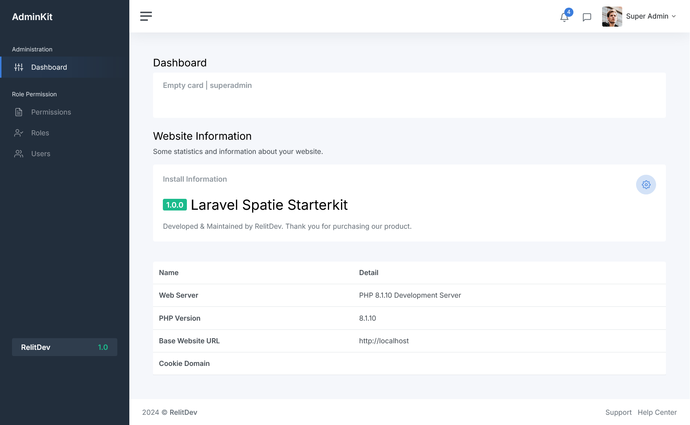
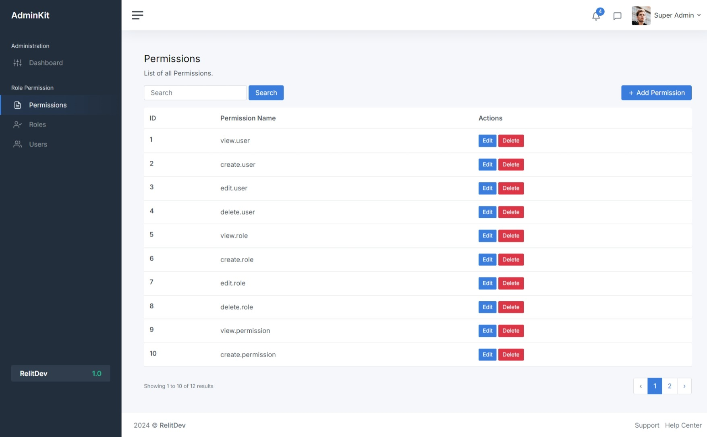
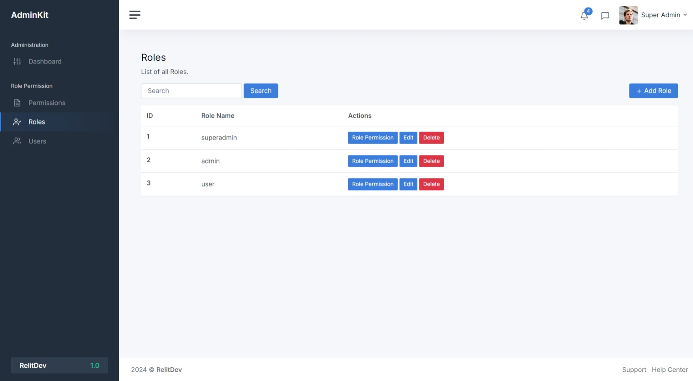
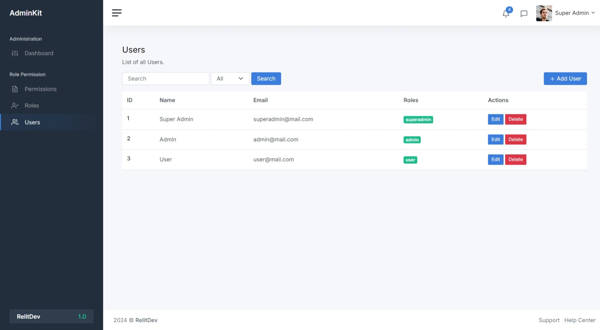

# Starterkit Laravel 10 dengan Spatie Permission menggunakan Template AdminKit

Aplikasi ini merupakan Starterkit Laravel 10 dengan Manajemen Akses Pengguna. 
Diharapkan dapat menjadi template awal untuk konfigurasi dan pengembangan aplikasi berbasis Laravel dengan fitur manajemen pengguna.

## Penggunaan
Aplikasi ini dirancang sebagai template untuk:
- Mempermudah pengelolaan akses pengguna.
- Mempercepat pengembangan aplikasi dengan fitur yang sudah tersedia.

## Fitur
- Halaman Dashboard.
- Halaman Kelola Pengguna.
- Halaman Kelola Permissions.
- Halaman Kelola Roles.

## Instalasi
1. Clone repository ini:
   ```bash
   git clone https://github.com/ujgsp/laravel-permission-starterkit.git
   ```
2. Masuk ke direktori proyek:
   ```bash
   cd laravel-permission-starterkit
   ```
3. Jalankan perintah berikut untuk menginstal dependensi:
   ```bash
   composer install
   ```
4. Salin file `.env.example` menjadi `.env`:
   ```bash
   cp .env.example .env
   ```
   Kemudian sesuaikan konfigurasi database Anda di file `.env`.

5. Jalankan migrasi dan seeder untuk membuat tabel dan data awal:
   ```bash
   php artisan migrate --seed
   ```
6. Generate kunci aplikasi:
   ```bash
   php artisan key:generate
   ```
7. Jalankan server pengembangan:
   ```bash
   php artisan serve
   ```
8. Buka aplikasi di browser pada alamat [http://localhost:8000](http://localhost:8000). Gunakan akun bawaan berikut untuk login:
   ```
   Email: superadmin@mail.com
   Password: password
   ```
## Antarmuka
Tampilan antarmuka aplikasi ini menggunakan [AdminKit](https://github.com/adminkit/adminkit) versi gratis, 
sebuah template admin modern yang responsif dan mudah dikustomisasi.

## Kontribusi
Kami sangat menghargai kontribusi Anda untuk pengembangan proyek ini. Berikut adalah beberapa cara untuk berkontribusi:

1. Laporkan [issue](https://github.com/ujgsp/laravel-permission-starterkit/issues) jika Anda menemukan bug atau masalah.
2. Ajukan [pull request](https://github.com/ujgsp/laravel-permission-starterkit/pulls) untuk:
   - Perbaikan bug.
   - Penambahan fitur baru.
   - Perbaikan dokumentasi.

## Screenshot
- Halaman Dashboard
   

- Halaman Permissions
   

- Halaman Roles
   

- Halaman Users
   


## Lisensi
Proyek ini dilisensikan di bawah MIT License. 
Silakan lihat file [Lisensi MIT](LICENSE) untuk informasi lebih lanjut.